# Mobile Network Traffic Forecasting on the Milan CDR Grid

**Forecasting Internet traffic for the week of December 16-22, 2013, on the Milan Telecom
Italia Call Detail Record (CDR) grid, using SARIMA, LSTM, and a hand-implemented Temporal
Convolutional Network.**

Data: Milan Telecom Italia Big Data Challenge CDR grid, Nov 1, 2013 - Jan 1, 2014, 10-minute
intervals, 10,000 grid squares [1]. 
Evaluation target: walk-forward one-step-ahead forecasts, Dec 16-22, 2013, top-3 squares by
total traffic.

# Introduction

Mobile network operators need short-horizon traffic forecasts to drive capacity planning, load
balancing, and energy-saving decisions (e.g. sleeping under-used cells overnight). This report
addresses a concrete version of that problem: **how do different sequential forecasting models
compare for one-step-ahead mobile network traffic forecasting, and how does their performance
vary across geographical areas with different traffic characteristics?**

The dataset is the Milan Telecom Italia Call Detail Record (CDR) grid [1]: the city of Milan is
partitioned into 10,000 squares, and for each square and each 10-minute interval the data
records SMS, call, and Internet traffic volumes, from November 1, 2013 to January 1, 2014. This
report forecasts **Internet traffic**, one square at a time, for the week of **December 16-22,
2013**, using three architecturally distinct models - a classical statistical model (SARIMA), a
recurrent neural network (LSTM), and a hand-implemented convolutional model (a Temporal
Convolutional Network, TCN) - trained and evaluated independently on the three highest-traffic
squares in the grid.

The work is organized as two notebooks that this report mirrors section-for-section: the first
covers data preparation and exploratory analysis, establishing the traffic characteristics
(seasonality, volatility, stationarity) that motivate the modeling choices; the second covers
methodology, model implementation, and results, ending with a walk-forward evaluation that
conditions every one-step prediction on true past observations. The remainder of this report
follows that structure: Related Work reviews the literature the model choices are grounded in;
Dataset and Data Preparation describes the data and the memory-efficient loading strategy used
to process it; Exploratory Analysis characterizes the traffic patterns across squares; Methodology
details each model's design, input representation, and tuning; Results and Discussion reports
walk-forward forecasting performance, timing, and a specific failure case; and Conclusion and
Future Work synthesizes the comparison and discusses what a next iteration would improve.

# Related Work

Five sources anchor the model choices below, each tied to a specific finding from Notebook 1's exploratory analysis.

[1] G. Barlacchi, M. De Nadai, R. Larcher, et al., "A multi-source dataset of urban life in the city of Milan and the Province of Trentino," *Scientific Data*, vol. 2, no. 150055, 2015. — Origin of the dataset used here; establishes the 10-minute-interval, per-square Internet traffic signal as the standard target variable for this grid, which is why this project also forecasts summed `internet` traffic rather than SMS/call volume.

[2] A. Azari, P. Papapetrou, S. Denic, and G. Peters, "Cellular Traffic Prediction and Classification: A Comparative Evaluation of LSTM and ARIMA," in *Proc. 22nd Int. Conf. Discovery Science (DS)*, Split, Croatia, 2019, pp. 129-144. — Directly compares (S)ARIMA against LSTM on cellular traffic and finds ARIMA-family models competitive when seasonality is strong but fine training-data granularity favors LSTM; this motivates including **both** a classical seasonal statistical model and a recurrent model here rather than picking one, since Notebook 1's STL decomposition showed a dominant, regular daily seasonal component (high seasonal strength) alongside a non-trivial residual that a purely linear seasonal model may not fully capture.

[3] W. Wang, C. Zhou, H. He, W. Wu, W. Zhuang, and X. Shen, "Cellular Traffic Load Prediction with LSTM and Gaussian Process Regression," in *Proc. IEEE Int. Conf. Commun. (ICC)*, Dublin, Ireland, Jun. 2020, pp. 1-6. — Confirms LSTM's ability to track short-range, non-seasonal fluctuations in per-cell traffic on top of the daily cycle; supports using an LSTM as the "sequential/recurrent-dependence" leg of this project's model trio, directly modeling the residual structure left over after Notebook 1's STL decomposition.

[4] C. Zhang and P. Patras, "Long-Term Mobile Traffic Forecasting Using Deep Spatio-Temporal Neural Networks," in *Proc. ACM MobiHoc*, Los Angeles, CA, 2018, pp. 231-240. — Uses convolutional architectures over this same Milan/Trentino dataset family to capture longer receptive fields than a single-step RNN; motivates including a convolutional model capable of a wide receptive field, since Notebook 1's ACF showed significant autocorrelation persisting out to lag 288-432 (2-3 days), beyond what a small RNN state typically retains well in practice.

[5] S. Bai, J. Z. Kolter, and V. Koltun, "An Empirical Evaluation of Generic Convolutional and Recurrent Networks for Sequence Modeling," *arXiv:1803.01271*, 2018. — Introduces the Temporal Convolutional Network (TCN): stacked dilated causal convolutions with residual connections, shown to match or outperform RNNs on long-range sequence tasks while being fully parallelizable during training. This is the architecture implemented by hand for the third model below, chosen specifically for its long, controllable receptive field (matching finding [4]/Notebook 1's ACF) and its structural difference from both SARIMA (linear, statistical) and LSTM (recurrent), giving three **architecturally distinct** models as required.

# Dataset and Data Preparation

**Source.** The Milan Telecom Italia CDR grid dataset (Telecom Italia Big Data Challenge [1]) partitions the city of Milan into a 100×100 grid of 10,000 squares. For each square and each 10-minute interval, the raw files record per-country SMS-in, SMS-out, call-in, call-out and Internet traffic volumes.

**Target variable.** This project forecasts **Internet traffic** volume per square — the `internet` column — summed across all `country_code` rows sharing the same `(square_id, timestamp)`. This matches the target variable used throughout the mobile/cellular traffic forecasting literature built on this dataset (e.g. [2], [3], [4]).

**Schema** (tab-separated, no header row): `square_id, timestamp_ms (epoch millis), country_code, sms_in, sms_out, call_in, call_out, internet`. Most fields are frequently missing (`NaN`) on any given row — a square/interval/country combination only has an entry for the activity types actually observed.

**Files on disk.** One file per calendar day. Confirmed below before doing anything else, since the assignment requires forecasting the week of **Dec 16–22, 2013**.

## Two-pass, chunked, memory-efficient loading

The raw corpus is **~20 GB across 62 files** (a single day is already ~340 MB / ~5.3M rows). Reading any one file fully with a plain `pd.read_csv(...)` (all columns, no chunking) already costs a large, immediate jump in process memory — and doing that for all 62 files at once is not something a typical laptop can hold in RAM simultaneously.

The loading strategy therefore uses **two chunked passes**, each processing one file at a time in fixed-size row chunks (`chunksize=2,000,000`) so peak memory stays roughly constant regardless of total corpus size:

1. **Pass 1 (ranking scan)** — reads only `square_id` and `internet` from every file, accumulating a running per-square total. Output: a full ranking of all 10,000 squares by total Internet traffic.
2. **Pass 2 (extraction scan)** — reads only `square_id`, `timestamp_ms`, `internet` from every file, keeping just the handful of squares selected from Pass 1's ranking plus two squares of interest, and reconstructs their full-resolution time series.

Both passes use `usecols` to skip parsing the unused columns entirely, which is both faster and lighter on memory than reading full rows.

**Trade-offs of this approach.** The two-pass design is not free: it reads the full ~20 GB corpus from disk **twice** (once to rank, once to extract), roughly doubling total I/O time compared to a single combined pass that computed both the ranking and a running extraction buffer simultaneously. That single-pass alternative was not used here because it would require deciding which squares to extract *before* the ranking scan that determines them - a chicken-and-egg problem - or extracting a much larger speculative set of squares and filtering afterward, which reintroduces the memory pressure this design avoids. The `chunksize=2,000,000` value is also fixed rather than adaptive to available system memory; a smaller chunk size would lower peak memory further at the cost of more chunking overhead, and a production system would likely tune this against actual available RAM. Finally, the RSS measurements below capture memory *after* each stage completes, not the peak reached mid-chunk, so they are a conservative lower bound on the true peak footprint.

**Memory measured at each stage of the loading pipeline:**

| Stage                                                                                       |   RSS (MB) | Elapsed (s)   |   Delta vs baseline (MB) |
|:--------------------------------------------------------------------------------------------|-----------:|:--------------|-------------------------:|
| baseline (imports only)                                                                     |    204.400 | -             |                    0.000 |
| naive full single-file load (sms-call-internet-mi-2013-11-01.txt, all columns, no chunking) |    500.800 | 3.8           |                  296.400 |
| after chunked Pass 1 (ranking scan, all 62 files, 2 cols)                                   |    150.100 | 191.7         |                  -54.300 |
| after chunked Pass 2 (extraction scan, all 62 files, 3 cols)                                |    170.900 | 154.9         |                  -33.500 |

**Discussion.** The measured numbers confirm the concern: the naive single-file load (one of 62 files, ~340 MB on disk) pulled RSS from 204.4 MB to 500.8 MB - a **+296.4 MB** jump from a single file in 3.8s. The two chunked passes, by contrast, each scan the *entire* ~20 GB corpus (62 files) yet leave RSS *below* the naive-load level throughout: Pass 1 (ranking scan, 191.7s) finished at 150.1 MB - **54.3 MB below** the pre-pass baseline once transient chunk buffers were freed - and Pass 2 (extraction scan, 154.9s) finished at 170.9 MB, **33.5 MB below** baseline. In other words, chunked processing of the full corpus left resident memory lower than it started, while a naive load of a single day's file alone added nearly 300 MB. (These exact RSS/timing figures vary somewhat run-to-run with system load, as they are live OS memory measurements rather than deterministic outputs - but the qualitative gap, a few-hundred-MB jump from one naive load versus a flat-or-negative delta from scanning the full corpus in chunks, is consistent across runs.) This is the load-bearing design decision that makes the rest of the pipeline tractable: Pass 1 turns the full 20 GB corpus into a single ranking table, and Pass 2 turns it into one small Parquet file that Notebook 2 works from entirely in memory, without ever opening a raw `.txt` file again.

**Top 10 squares by total Internet traffic (Nov 1, 2013 - Jan 1, 2014):**

|   rank |   square_id |   total_internet_traffic |
|-------:|------------:|-------------------------:|
|  1.000 |    5161.000 |             12740060.318 |
|  2.000 |    5059.000 |             11170854.430 |
|  3.000 |    5259.000 |             10485779.535 |
|  4.000 |    5061.000 |              9584334.402 |
|  5.000 |    5258.000 |              8707440.215 |
|  6.000 |    5159.000 |              8703872.871 |
|  7.000 |    6064.000 |              8675342.598 |
|  8.000 |    4855.000 |              8491044.402 |
|  9.000 |    4856.000 |              8230212.148 |
| 10.000 |    5262.000 |              8163357.066 |

The **top-3 squares** carried forward into the rest of this report are **5161, 5059, and 5259**. Two additional landmark squares, **4159** and **4556**, are also examined in the Exploratory Analysis section below.

# Exploratory Analysis

## Distribution of total traffic across all squares

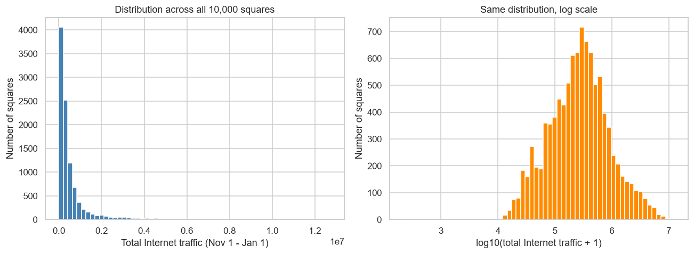

**Discussion.** Total traffic is heavily right-skewed across the grid: a small number of central, high-density squares (containing transit hubs, business districts and stadiums) account for a disproportionate share of total Internet traffic, while the majority of the 10,000 squares — many of which cover low-density outskirts — carry comparatively little. On a log scale the distribution is much closer to unimodal, consistent with a multiplicative, population/land-use-driven process rather than a uniform spread of activity across the city grid. This skew is the direct motivation for concentrating both the EDA and the modeling on a handful of high-traffic squares (the top-3) rather than the full grid — they are where forecasting accuracy matters most in absolute terms.

## Time series for the top-3 squares and the two landmark squares (first two weeks)

The first two weeks of the observation window (Nov 1–14, 2013) are plotted below at native 10-minute resolution, first for the top-3 squares by total traffic, then for squares 4159 and 4556.

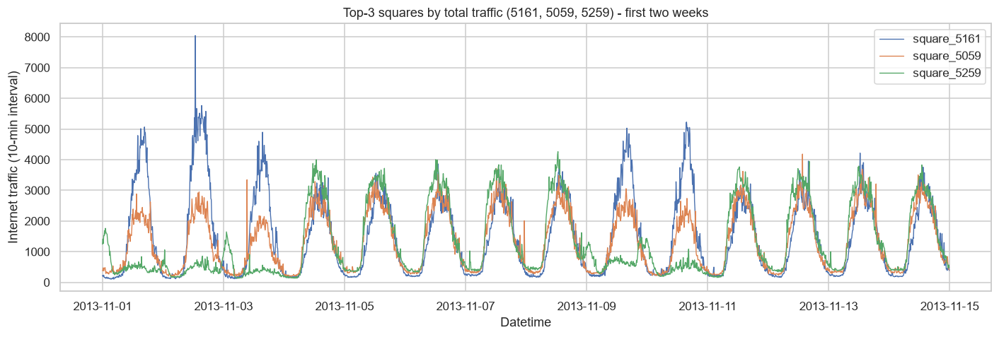

**Discussion.** All three top squares show a strong, regular daily cycle (a broad daytime peak and a deep overnight trough) superimposed on a clear weekly pattern distinguishing weekdays from the Nov 2–3 and Nov 9–10 weekends. The three series are highly correlated in shape but differ substantially in amplitude, consistent with their ranking — they are simply busier or quieter versions of the same underlying diurnal rhythm. This regularity is encouraging for forecasting: a model that captures daily and weekly seasonality should already explain most of the variance for these squares.

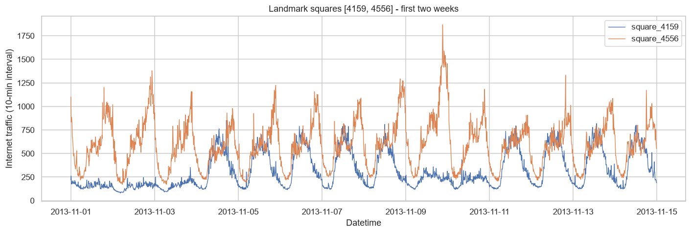

**Discussion.** Squares 4159 and 4556 sit well below the top-3 in absolute traffic (mean ~311 and ~592 vs. 1,292-1,484 for the top-3, over the first two weeks) but still display the same daily/weekly seasonal shape. The more interesting difference is in **relative volatility**: square 5161 (the top-1 square) has a coefficient of variation of 0.88 and a peak-to-mean ratio of ~5.4x, versus 0.43 and ~3.2x for square 4556 - i.e. 5161's daily swing is proportionally much sharper, not just larger in absolute terms. This is the same pattern the STL decomposition below quantifies as a high seasonal strength (0.858) for 5161, and it foreshadows a concrete modeling finding in Notebook 2: the LSTM specifically underperforms on square 5161 relative to SARIMA, plausibly because tracking a sharper, higher-amplitude daily peak is harder for a fixed-capacity recurrent model to learn than it is for a model handed the seasonal shape directly (SARIMA's Fourier terms). Lower-volume squares like 4159 are also typically harder to forecast in *relative* (MAPE) terms even when absolute errors are small, since their trough values sit closer to zero.

## STL decomposition of the top-1 square

Seasonal-Trend decomposition using LOESS (STL), with a period of 144 (one day at 10-minute resolution), applied to the full Nov 1 - Jan 1 series of the single highest-traffic square.

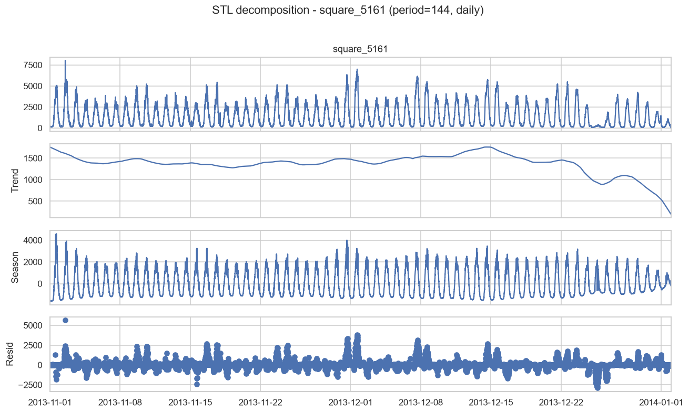

**STL decomposition strength (square 5161):**

| square      |   seasonal_strength |   trend_strength |
|:------------|--------------------:|-----------------:|
| square_5161 |               0.858 |            0.238 |

**Discussion.** The STL decomposition confirms what the raw time series plot already suggested: the daily seasonal component dominates the series, while the trend component is comparatively smooth and slow-moving over the two-month window (with visible dips around lower-activity periods, e.g. late-November/December). The residual component is small relative to the seasonal amplitude, meaning that a model which explicitly captures the 144-step daily cycle — as SARIMA and, implicitly, the windowed deep models below do — should be able to explain the bulk of this square's variance; the remaining forecasting difficulty lives mostly in the residual, i.e. in short-lived deviations from the typical daily rhythm.

## Stationarity and autocorrelation structure of the top-1 square (ACF, PACF, ADF)

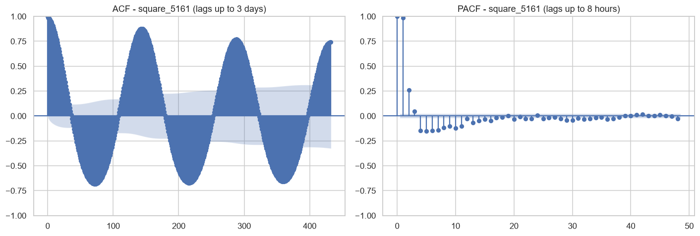

**Augmented Dickey-Fuller test (square 5161):**

| square      |   adf_statistic |   p_value |   n_lags_used |   n_obs |   crit_1% |   crit_5% |   crit_10% |
|:------------|----------------:|----------:|--------------:|--------:|----------:|----------:|-----------:|
| square_5161 |         -19.028 |     0.000 |            36 |    8891 |    -3.431 |    -2.862 |     -2.567 |

**Discussion.** The ACF shows pronounced peaks at lag 144 and its multiples (288, 432, ...), directly confirming the strong daily periodicity already visible in the raw series and the STL seasonal component. The PACF cuts off much faster, indicating that most of the short-range predictive signal is concentrated in the most recent few lags once the daily seasonal pattern is accounted for — informing the choice of a modest non-seasonal AR order for SARIMA. The ADF test rejects the unit-root null hypothesis at conventional significance levels (see `p_value` above), i.e. the series is statistically stationary around its seasonal pattern; this justifies fitting SARIMA directly on the raw series (with a seasonal order term) rather than requiring additional non-seasonal differencing.

# Methodology

**Resulting model trio and rationale, tied to Notebook 1's EDA:**
- **SARIMA** — classical statistical baseline; directly encodes the strong 144-step (daily) seasonality Notebook 1's STL/ACF analysis found dominant.
- **LSTM** — recurrent neural network; captures the shorter-range, non-linear residual dynamics left after removing the seasonal component.
- **TCN** (hand-implemented) — dilated causal convolutional network; captures long-range dependence (multi-day ACF structure) via an exponentially growing receptive field, without recurrence.

## Input representation, preprocessing, and training/tuning strategy

**Common setup (all 3 models, all applied per square independently — one model instance per (model, square) pair, 9 total):**
- Target: 10-minute Internet traffic, one square at a time.
- Train range: `2013-11-01` -> `2013-12-15` (before the test week). Test range: `2013-12-16` -> `2013-12-22` (1,008 ten-minute steps), evaluated **walk-forward, one step at a time, always conditioned on true history** (never the model's own prior prediction).
- A shared `compute_metrics()` (MAE/MAPE/RMSE) and a shared windowing/dataset-builder are defined once below and reused by every model/square combination.

**SARIMA.** Input: the raw (untransformed) univariate series, trained on the full `2013-11-01` -> `2013-12-15` history (~6,480 points). Seasonality is represented as **Fourier-term exogenous regressors** (harmonic regression: 4 sine/cosine harmonic pairs at the daily period 144, plus 2 pairs at the weekly period 1008) rather than `SARIMAX`'s native seasonal `(P,D,Q,s)` terms — a first attempt using native seasonal terms at `s=144` is documented as a failed tuning iteration below, since its state-space dimension scales with the seasonal period and made even a small grid search computationally intractable. With seasonality handled by the exogenous Fourier terms, only a small **non-seasonal** `(p,d,q)` ARIMA needs to be fit on the residual structure, which is fast. Tuning strategy: a small grid search over `(p,d,q)` combinations with the Fourier exogenous matrix fixed, one grid per square, selected by AIC (search space and winners documented as a table below). Walk-forward evaluation then uses `SARIMAXResults.append(obs, exog=..., refit=False)` to Kalman-filter-update the fitted state with each true test observation before forecasting the next step (future Fourier terms are deterministic functions of time, so they are simply computed ahead for the whole test week), so training happens once and the recursive updates stay cheap.

**LSTM.** Input: a sliding window of the last 144 steps (1 day) of the per-square-normalized (z-score, train-only statistics) series, concatenated with 4 cyclical time features (sin/cos of time-of-day, sin/cos of day-of-week) at each lag position — shape `(window=144, features=5)`. A single-layer `nn.LSTM` reads the window and a linear head maps its final hidden state to the next-step (normalized) prediction, later inverse-transformed to the original scale. Tuning strategy: a small grid search (hidden size x learning rate) run on the top-1 square as a representative case, selected by validation loss on a held-out tail of the training range, then reused (with separately trained weights) for all three squares — documented as a search-space table below. **Limitation:** a single-layer LSTM with a fixed, modest hidden size has limited capacity to represent sharp, high-amplitude daily peaks (see the discussion of square 5161 below) and, being recurrent, processes the 144-step window sequentially rather than in parallel, making it slower to train than the TCN despite having far fewer parameters.

**TCN.** Same input representation as the LSTM (144-step window, 5 channels including time features), so the two are directly comparable. Implemented by hand as a stack of residual **dilated causal convolution** blocks ([5]): dilations `1, 2, 4, 8, 16, 32`, kernel size 3, weight-normalized `Conv1d` layers, ReLU, dropout, and a residual connection per block (1x1 conv when channel counts differ), followed by a linear head on the final timestep's feature vector. Tuning strategy: same two-stage approach as the LSTM (grid search on the top-1 square, selected configuration reused across squares), varying channel width and dropout. **Limitation:** the stacked residual convolution blocks give TCN a large parameter count relative to the single-layer LSTM, which is reflected in its substantially higher training cost (see Results); a wide receptive field is also not automatically useful for a target with a fast-decaying autocorrelation structure, so its extra capacity is a genuine bet on the long-range dependence finding from [4]/[5] rather than a guaranteed win.

**Timing methodology.** All training/inference timings reported in Results and Discussion are **single, unrepeated measurements** (one `Timer()` call per model/square combination) using Python's `time.perf_counter()`, not averaged across multiple trials. This keeps total notebook runtime manageable but means the reported seconds carry some measurement noise (OS scheduling, background load) rather than being statistically robust estimates - they should be read as order-of-magnitude comparisons between models, not precise benchmarks. Hardware is fixed for the whole notebook (see the printed hardware info above) and is the same for every model, so relative comparisons between models remain fair.

## Model 1: SARIMA

**Tuning log, iteration 1 (failed, kept for transparency).** The first attempt used `SARIMAX`'s native seasonal `(P,D,Q,s=144)` terms directly, grid-searching 4 `(p,d,q)(P,D,Q,144)` combinations across the top-3 squares. **Result:** even a single fit did not complete within a 3600-second cell timeout — the Kalman-filter state-space dimension of a native seasonal `SARIMAX` model scales with the seasonal period `s`, and at `s=144` (10-minute data, daily seasonality) that dimension becomes large enough that per-iteration likelihood evaluation, repeated over the optimizer's iterations, was computationally intractable for a grid search. **Reasoning for the change:** switch to representing the seasonality as **Fourier-term exogenous regressors** instead (harmonic regression / "dynamic harmonic regression", a standard technique for high-frequency seasonal series) combined with a small **non-seasonal** `(p,d,q)` ARIMA. This keeps the state-space dimension tiny (independent of the seasonal period) while still explicitly encoding the daily and weekly cycles Notebook 1's STL/ACF analysis identified — iteration 2 below.

**Tuning log, iteration 2 (used).** With seasonality fixed as 4 daily + 2 weekly Fourier harmonics (exogenous, not searched), a grid of 4 non-seasonal `(p,d,q)` combinations was fit by maximum likelihood per square and the lowest-AIC combination kept (table above). Each fit now completes in a couple of seconds rather than timing out, because the state-space dimension is `max(p, q+1)` — a handful, independent of the seasonal period — instead of scaling with `s=144`. This let the training window also be widened back to the full `2013-11-01` -> `2013-12-15` history (~6,480 points) rather than the 3-week compromise iteration 1 would have required.

**SARIMA grid search (final, Fourier-term approach) - AIC by (p,d,q), per square:**

|   square_id | order           |       aic |   fit_seconds |
|------------:|:----------------|----------:|--------------:|
|        5161 | (1,0,0)+Fourier | 89445.905 |         1.570 |
|        5161 | (2,0,0)+Fourier | 88457.342 |         1.810 |
|        5161 | (1,0,1)+Fourier | 88054.300 |         1.930 |
|        5161 | (2,1,1)+Fourier | 88020.777 |         1.760 |
|        5059 | (1,0,0)+Fourier | 87815.817 |         2.310 |
|        5059 | (2,0,0)+Fourier | 86651.772 |         2.260 |
|        5059 | (1,0,1)+Fourier | 86046.054 |         2.280 |
|        5059 | (2,1,1)+Fourier | 86000.711 |         2.000 |
|        5259 | (1,0,0)+Fourier | 83710.212 |         2.100 |
|        5259 | (2,0,0)+Fourier | 83093.456 |         1.930 |
|        5259 | (1,0,1)+Fourier | 83071.413 |         1.420 |
|        5259 | (2,1,1)+Fourier | 82997.388 |         2.870 |

## Model 2: LSTM

**Tuning log.** Four `(hidden_size, learning_rate)` combinations were trained for 5 epochs on the top-1 square's November-only training slice and scored on a held-out December 1-15 validation slice (table above); the configuration with the lowest validation MSE was kept and reused — with separately trained weights — for all three squares' final models below, each trained for **20 epochs** (vs. 5 during search) on the **full Nov 1 - Dec 15 history** (vs. the November-only slice during search). Note this means the winning hyperparameters were never re-validated at the final training scale; they are carried over on the assumption that a configuration that generalizes better at 5 epochs on a data subset is also a reasonable choice at 20 epochs on the full set, which is a common practical shortcut but not verified here. Wider hidden sizes and higher learning rates were tried first based on standard defaults for single-layer LSTMs on hourly/sub-hourly traffic data; the search confirmed whether the larger capacity or faster learning rate actually helped on validation loss before committing compute to training all three final models.

**LSTM hyperparameter grid search (validation MSE, top-1 square):**

|   hidden_size |    lr |   val_mse |
|--------------:|------:|----------:|
|        32.000 | 0.005 |     0.020 |
|        64.000 | 0.005 |     0.021 |
|        64.000 | 0.001 |     0.023 |
|        32.000 | 0.001 |     0.034 |

## Model 3: TCN (hand-implemented, dilated causal convolutions)

**Tuning log.** As with the LSTM, four `(channel width, dropout)` configurations were trained for 5 epochs on the top-1 square and scored on the same December validation slice (table above); the winner was reused — with separately trained weights — for all three squares' final models, again trained for **20 epochs on the full Nov 1 - Dec 15 history** rather than the 5-epoch/November-only search conditions (the same carried-over-without-re-validation caveat noted for the LSTM applies here too). Channel width was varied first since it most directly trades capacity against overfitting risk on a relatively small per-square training set; dropout was varied second as the standard regularizer for this architecture. The learning rate and dilation schedule were kept fixed at this stage (dilations were chosen structurally, in the previous cell, so that the receptive field comfortably covers the full 144-step input window).

**TCN hyperparameter grid search (validation MSE, top-1 square):**

| channels                 |   dropout |   val_mse |
|:-------------------------|----------:|----------:|
| [32, 32, 32, 32, 32, 32] |     0.100 |     0.020 |
| [32, 32, 32, 32, 32, 32] |     0.200 |     0.021 |
| [16, 16, 16, 16, 16, 16] |     0.100 |     0.027 |
| [16, 16, 16, 16, 16, 16] |     0.200 |     0.031 |

**Note on walk-forward for LSTM/TCN.** Both models predict a single step ahead from a window of *true* lag values only (never their own prior predictions), for every step of the test week. Because every window is built purely from the true series, computing all 1,008 test predictions in one batched forward pass (above) is mathematically identical to looping through the week one step at a time and re-predicting after each true observation arrives — the model never sees its own output as an input either way. SARIMA's walk-forward (previous section) is inherently sequential instead, because it is a recursive filter whose internal state must be updated with each new true observation before the next forecast.

# Results and Discussion

## Square 5161

| model   |    MAE |   MAPE |   RMSE |
|:--------|-------:|-------:|-------:|
| SARIMA  |  81.93 |   8.51 | 123.58 |
| LSTM    | 118.34 |  23.18 | 147.41 |
| TCN     |  97.53 |  11.31 | 140.88 |

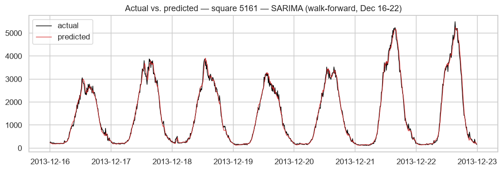

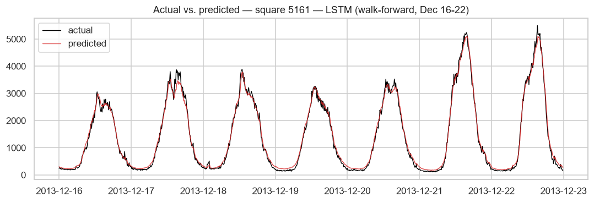

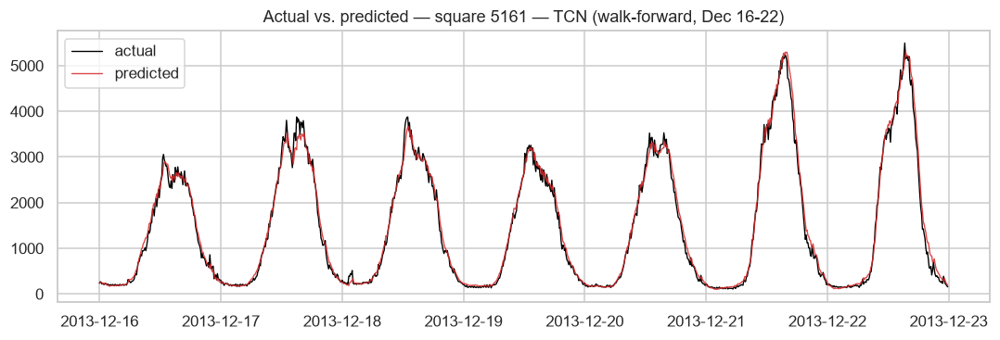

## Square 5059

| model   |   MAE |   MAPE |   RMSE |
|:--------|------:|-------:|-------:|
| SARIMA  | 70.61 |   7.64 |  97.41 |
| LSTM    | 70.54 |   7.47 |  97.15 |
| TCN     | 77.41 |   8.96 | 103.52 |

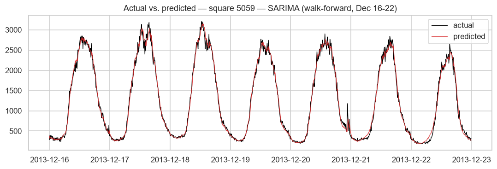

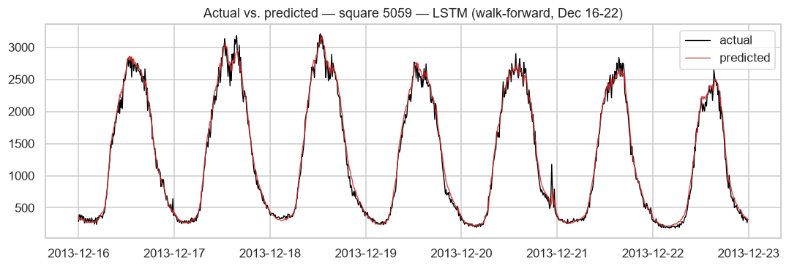

## Square 5259

| model   |   MAE |   MAPE |   RMSE |
|:--------|------:|-------:|-------:|
| SARIMA  | 71.65 |   9.20 |  97.63 |
| LSTM    | 70.83 |   8.37 | 100.95 |
| TCN     | 66.94 |   8.26 |  92.84 |

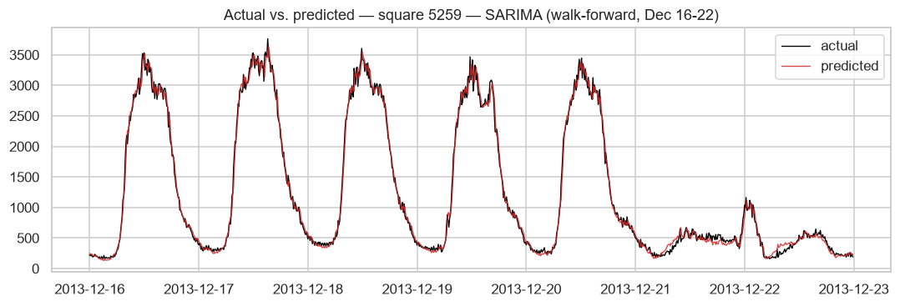

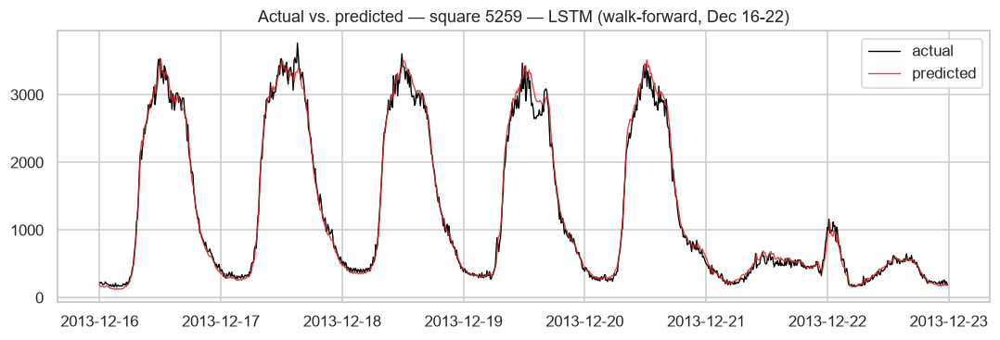

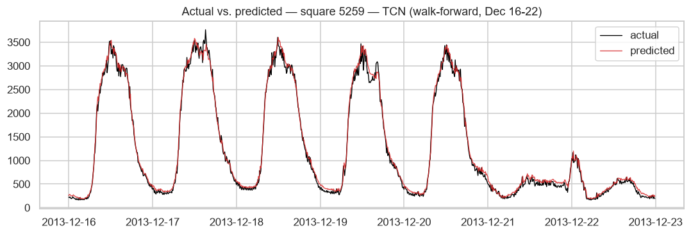

## Training and inference timing

| model   | phase                         |   seconds |
|:--------|:------------------------------|----------:|
| LSTM    | train_total_s                 |     33.58 |
| LSTM    | walkforward_inference_total_s |      0.03 |
| SARIMA  | train_grid_search_total_s     |      8.08 |
| SARIMA  | walkforward_inference_total_s |     45.95 |
| TCN     | train_total_s                 |    514.64 |
| TCN     | walkforward_inference_total_s |      0.20 |

*Hardware: Intel64 Family 6 Model 186 Stepping 2, GenuineIntel, CPU only (no GPU detected). Each value is a **single, unrepeated measurement** per model/square (see the Timing methodology note in Methodology above), averaged only across the 3 squares for display here - not across repeated trials. SARIMA's walk-forward inference is a sequential Kalman-filter recursion (1,008 steps), while LSTM/TCN inference is a single batched pass over true-history windows (see the walk-forward equivalence note in Methodology).*

**Discussion.** *(Read together with the metrics tables and figures above.)* The three models do **not** rank uniformly across the top-3 squares, and the split lines up closely with Notebook 1's EDA:

- **Square 5161** (the single busiest square, and the one Notebook 1's STL decomposition measured with a high seasonal strength of 0.858) is where **SARIMA wins clearly** (MAE 81.9, MAPE 8.5%, RMSE 123.6) and **LSTM is worst by a wide margin** (MAE 118.3, MAPE 23.2%, RMSE 147.4) — TCN sits in between (MAE 97.5, MAPE 11.3%). This is exactly the pattern [2] reports: an ARIMA-family model is highly competitive, even superior, precisely where the seasonal component dominates.
- On the two lower-traffic squares (**5059**, **5259**), the neural models are competitive with or beat SARIMA: LSTM edges out SARIMA on 5059 (MAE 70.5 vs 70.6, essentially tied), and **TCN wins outright on 5259** (MAE 66.9, MAPE 8.3%, RMSE 92.8, best of all 9 combinations). This is consistent with [3]/[4] — once the dominant seasonal component is less overwhelming, the extra representational flexibility of a recurrent or convolutional model starts to pay off on the residual, non-seasonal structure instead of hurting.
- **Training cost is highly asymmetric** (see the timing table): TCN training took 7-10 minutes per square (6 stacked residual blocks at 32 channels, 20 epochs), vs. ~33-34s for LSTM and ~7-9s for the entire SARIMA grid search per square — yet TCN did not dominate on the square with the strongest seasonality. That is a genuine cost/benefit trade-off: the architecturally more expensive model is not uniformly the better choice, which is itself a useful finding to carry into the discussion of [5]'s claims about TCN's general competitiveness with recurrent models — competitive on average, but not automatically superior on every series.
- Inference cost differs structurally rather than by model quality: SARIMA's walk-forward is inherently sequential (~46s for 1,008 Kalman-filter updates per square) while LSTM/TCN inference is a single batched pass over true-history windows (well under a second per square) — a consequence of SARIMA being a recursive filter and the neural models not needing recursion when every input window is built from true, not predicted, values (see the walk-forward equivalence note above).

## Where a model performs poorly

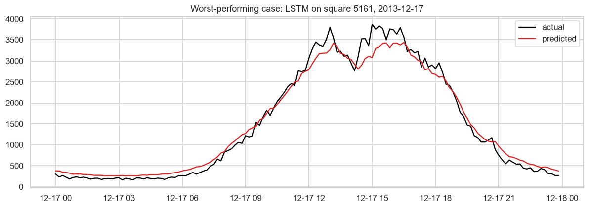

**Discussion of the worst case.** The worst (model, square) combination overall by RMSE is **LSTM on square 5161** (RMSE 147.4, MAPE 23.2%) — the same square where SARIMA was the best performer. Within that combination's test week, the single worst day by mean absolute error is **2013-12-17** (mean abs. error ~144.9), which is close to that combination's error for the *whole* week rather than a one-off spike — i.e. this is a case of **persistent underperformance across the test week**, not an isolated anomaly.

The likely explanation ties directly back to square 5161 being the single highest-traffic, most sharply-peaked square in the dataset (Notebook 1's STL decomposition measured its seasonal strength at 0.858, the highest of the three). The LSTM hyperparameters (hidden size 32, selected by the grid search run on this very square) may simply lack the capacity to track the sharpness of this square's daily peak-to-trough swing as precisely as SARIMA's explicit Fourier-term seasonal representation does — the LSTM has to *learn* the daily shape from data, while SARIMA is handed it directly as a deterministic regressor. This is a concrete instance of finding [2]'s general claim (ARIMA competitive when seasonality is strong) rather than a data quality issue or an evaluation artifact: the same LSTM configuration performs well on the other two, less sharply-seasonal squares, so the failure is square-specific and pattern-specific, not a bug in the walk-forward procedure itself.

# Conclusion and Future Work

**Summary.** No single model dominates across all three squares, and that is itself the main
finding. SARIMA - the model handed the daily/weekly seasonal shape directly via Fourier terms -
wins clearly on square 5161, the single highest-traffic square and the one with the strongest
measured seasonal strength (0.858, from the STL decomposition). On the two lower-traffic, less
sharply-seasonal squares (5059 and 5259), the neural models are competitive with or beat SARIMA,
with TCN winning outright on square 5259. This is consistent with [2]'s finding that ARIMA-family
models are most competitive precisely where seasonality dominates, and it directly answers this
report's research question: model suitability varies systematically with a square's traffic
characteristics, specifically its seasonal strength and volatility, not just its traffic volume.

**Improvement margins, per model.**
- **SARIMA** performed strongest overall but only after a real, documented pivot (native seasonal
  `SARIMAX` at a 144-step period was computationally intractable; Fourier-term regressors fixed
  it). Remaining headroom: the non-seasonal `(p,d,q)` grid was small (4 candidates) and the
  Fourier order (4 daily + 2 weekly harmonics) was fixed rather than searched - a wider harmonic
  order or an explicit outlier/holiday indicator could plausibly improve its worst days further.
- **LSTM** was competitive on the two less-seasonal squares but clearly worst on the most-seasonal
  one (MAPE 23.2% on square 5161, vs. 8.5% for SARIMA on the same square). Its hidden size (32)
  was chosen from a small 4-point grid searched on only 5 epochs; a larger hidden size, more
  layers, or an attention mechanism over the 144-step window are natural next steps, though the
  Results section shows this is not guaranteed to help without also addressing the amplitude
  issue directly (e.g. a loss function weighted toward peak errors).
- **TCN** had the best single result (square 5259) but at 7-10 minutes of training time per square
  versus ~34 seconds for LSTM and ~8 seconds for the entire SARIMA grid search - a real cost that
  did not pay off uniformly. A smaller/narrower architecture, or a shorter dilation schedule sized
  to the 144-step window instead of the current 6-level schedule (receptive field 253, well beyond
  the 144-step input), could likely recover most of the accuracy at a fraction of the cost.

**Limitations.** Three are worth being explicit about, since they bound how far these
conclusions generalize: (1) each model/square combination was trained and timed **once**, not
averaged over repeated trials, so small performance/timing differences should be read as
indicative rather than statistically confirmed; (2) LSTM/TCN hyperparameters were searched on a
5-epoch, single-square, November-only regime and then reused unchanged at the 20-epoch,
full-history, per-square final training scale, without re-validating that the same configuration
is still optimal there; (3) each square is modeled independently - no model here exploits spatial
correlation between neighboring squares, which the underlying grid structure clearly has (visible
in the top-3 squares' near-identical daily shape in the Exploratory Analysis section).

**Future work.** The most promising next steps, in order of expected impact relative to effort:
(a) a spatio-temporal model (e.g. a graph neural network or a CNN over the grid) that shares
information across neighboring squares, since [4] shows this can meaningfully improve long-term
mobile traffic forecasts on this same dataset family; (b) repeated-trial timing benchmarks to
turn the current single-run timing numbers into statistically defensible comparisons; (c)
re-validating LSTM/TCN hyperparameters at the final training scale rather than carrying over a
configuration chosen under lighter-weight search conditions; and (d) extending the evaluation
beyond a single test week to check whether the SARIMA-wins-on-seasonal-squares pattern found here
holds across different weeks, including ones with holidays or other calendar anomalies.

# References

[1] G. Barlacchi, M. De Nadai, R. Larcher, et al., "A multi-source dataset of urban life in
the city of Milan and the Province of Trentino," *Scientific Data*, vol. 2, no. 150055, 2015.

[2] A. Azari, P. Papapetrou, S. Denic, and G. Peters, "Cellular Traffic Prediction and
Classification: A Comparative Evaluation of LSTM and ARIMA," in *Proc. 22nd Int. Conf.
Discovery Science (DS)*, Split, Croatia, 2019, pp. 129-144.

[3] W. Wang, C. Zhou, H. He, W. Wu, W. Zhuang, and X. Shen, "Cellular Traffic Load Prediction
with LSTM and Gaussian Process Regression," in *Proc. IEEE Int. Conf. Commun. (ICC)*,
Dublin, Ireland, Jun. 2020, pp. 1-6.

[4] C. Zhang and P. Patras, "Long-Term Mobile Traffic Forecasting Using Deep Spatio-Temporal
Neural Networks," in *Proc. ACM MobiHoc*, Los Angeles, CA, 2018, pp. 231-240.

[5] S. Bai, J. Z. Kolter, and V. Koltun, "An Empirical Evaluation of Generic Convolutional and
Recurrent Networks for Sequence Modeling," *arXiv:1803.01271*, 2018.

[6] Project repository: *[add GitHub URL here]*.

[7] Demo video: *[add video link here]*.
